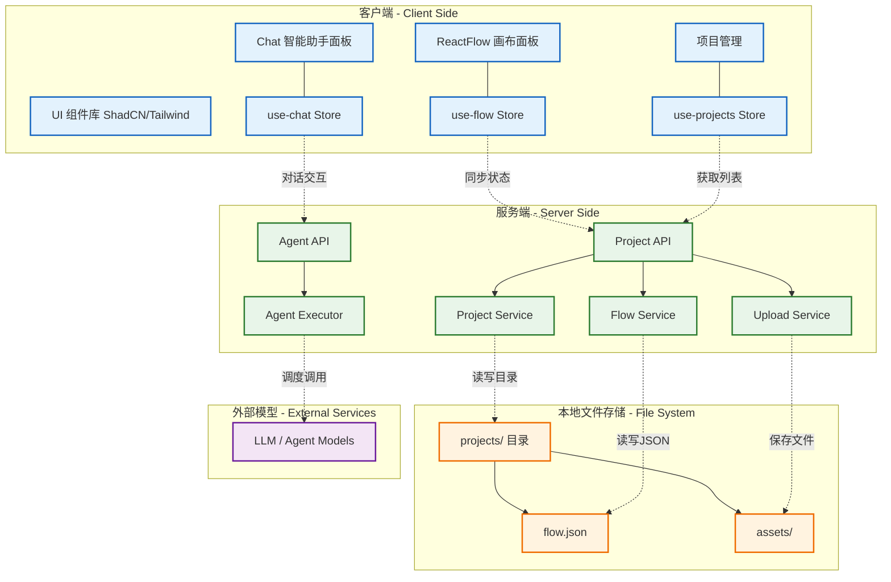

# Node-Flow 项目技术架构图

本文档提供了 `node-flow` 项目的技术架构概览，适用于项目汇报与开发参考。

## 1. 系统总体架构

系统基于 Next.js 14 (App Router) 构建，采用前后端分离同构模式。前端通过 ReactFlow 提供可视化节点编辑能力，后端依赖 Next.js API Routes 提供数据持久化与 Agent 代理执行服务。数据最终持久化在本地文件系统中。

## 2. 核心技术栈

| 分类          | 技术栈                                                                         | 说明                                                   |
| :------------ | :----------------------------------------------------------------------------- | :----------------------------------------------------- |
| **框架**      | [Next.js 14](https://nextjs.org/)                                              | 使用 App Router，服务端渲染与 API 路由聚合             |
| **画布**      | [ReactFlow](https://reactflow.dev/)                                            | 实现复杂节点拖拽、连线及交互面板，状态集中管理         |
| **状态管理**  | [Zustand](https://zustand-demo.pmnd.rs/)                                       | 轻量级状态管理，拆分为 flow, chat, projects 多个 store |
| **UI 组件库** | [ShadCN UI](https://ui.shadcn.com/) + [Tailwind CSS](https://tailwindcss.com/) | 灵活的原子化 CSS 与可定制化无头组件库                  |
| **国际化**    | [next-intl](https://next-intl-docs.vercel.app/)                                | 多语言支持，文本数据与组件代码分离                     |
| **本地存储**  | Node.js `fs`                                                                   | 直接读写本地 `projects/[id]` 目录文件进行持久化        |

## 3. 业务模块划分

- **画布模块 (`components/flow`)**: 提供核心可视化编辑能力，包含多种自定义节点类型（`asset-node`, `scene-node`, `episode-node` 等），数据实时双向绑定。
- **Agent/对话模块 (`components/chat`)**: 侧边栏助手，包含 Chat 界面与 Agent 选择执行机制，提供与用户进行对话指令交互的功能。
- **项目管理模块 (`components/project`)**: 实现项目的新建、切换与项目状态的加载与存储。
- **核心服务模块 (`lib/core` & `lib/services`)**: 封装对本地文件系统操作的安全控制（仅限读取项目本身 `projects/` 路径），防止跨目录访问，保障数据隔离。
